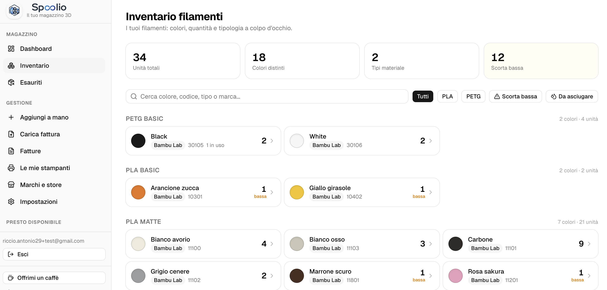
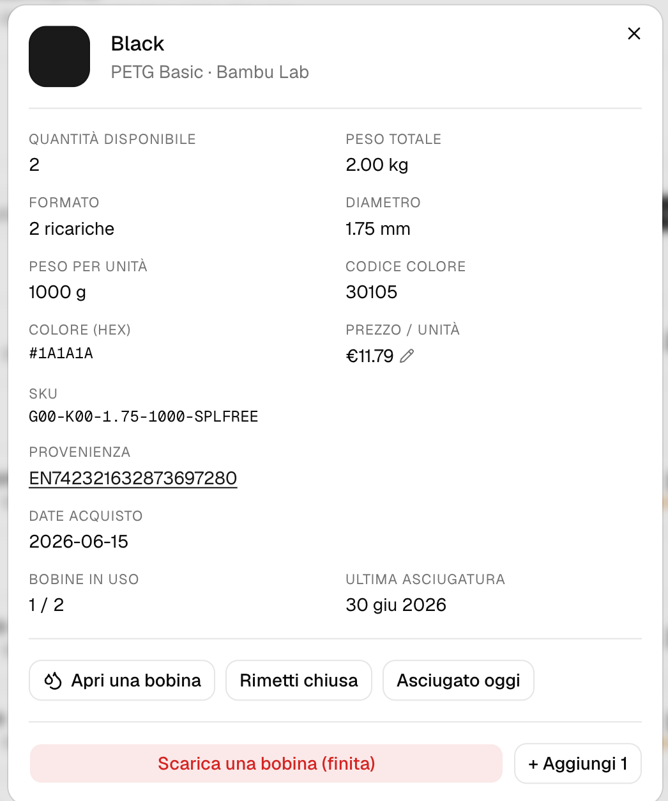
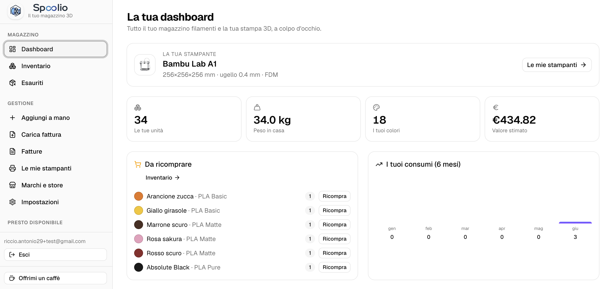
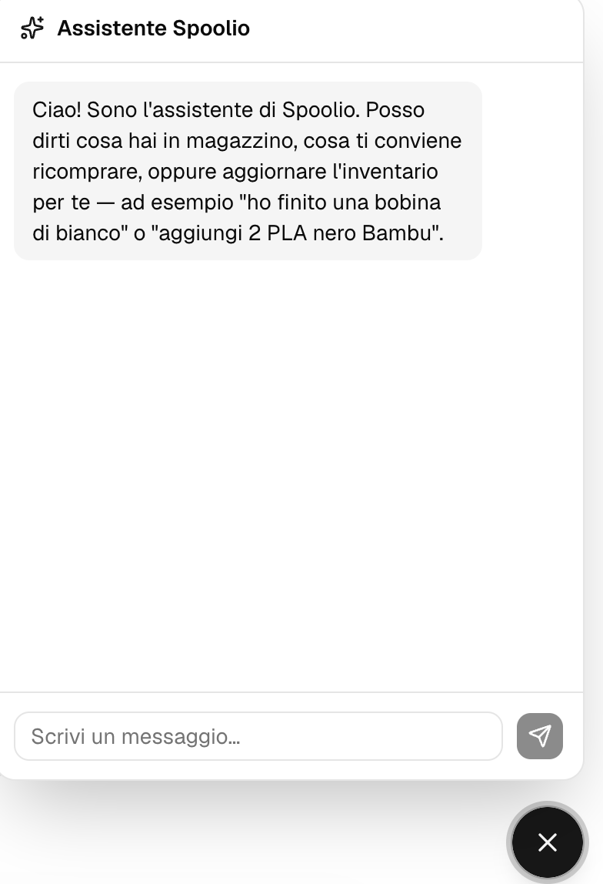
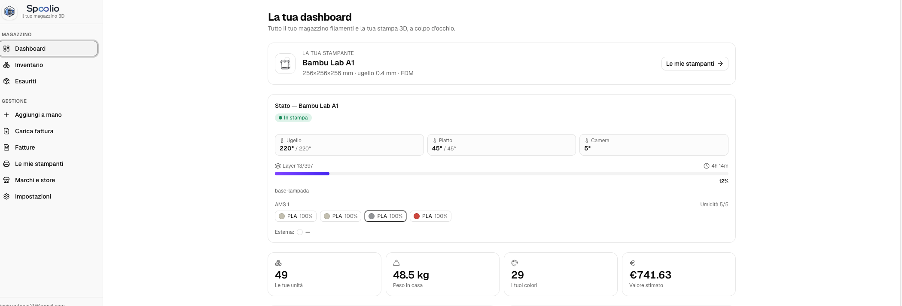

# Spoolio 🧵

Il tuo magazzino filamenti per stampa 3D: colori, quantità, tipologia (PLA, PETG, …) e costi a colpo d'occhio, con import delle fatture via PDF e un assistente AI. Un progetto **DomoticLab**.

> **Licenza source-available** (AGPL-3.0 + Commons Clause): puoi usarlo, studiarlo e modificarlo liberamente; le modifiche devono restare aperte; **non puoi venderlo**. Vedi [Licenza](#licenza).

## Cos'è

Web app per l'inventario dei filamenti per stampa 3D: vedi colori, quantità e tipologie, aggiorni l'inventario importando le fatture in PDF o inserendo prodotti a mano, tieni traccia di consumi, valore e riacquisti. Multi-utente: ogni account vede solo i propri dati. UI e contenuti in **italiano**.

## Screenshot

| Inventario | Dettaglio bobina (asciugatura) |
|---|---|
|  |  |

| Dashboard | Assistente AI |
|---|---|
|  |  |

## Stack

- **Next.js 16** (App Router) + **React 19** + **TypeScript**
- **Tailwind CSS v4** + **shadcn/ui** (icone lucide-react)
- **Supabase** all-in-one: **Postgres** (dati, con Row Level Security per-utente), **Auth** (email+password, magic link, Google, 2FA TOTP) e **Storage** (PDF fatture)
- **unpdf** per estrarre il testo dai PDF
- **AI multi-provider** (Claude/OpenAI/OpenRouter/Gemini/DeepSeek/NVIDIA NIM/ endpoint OpenAI-compatibile) come fallback di parsing fatture e per l'assistente
- **better-sqlite3** usato solo per export/import del backup `.db`

## Come funziona l'import fatture

1. **Parser deterministico Bambu** (`src/lib/bambu.ts`): lo SKU Bambu (`A01-K1-1.75-1000-SPLFREE`) è una chiave stabile → materiale, colore, diametro, peso e formato (bobina/ricarica). Zero costi, nessuna AI.
2. **Fallback AI** (`src/lib/parseInvoice.ts`): usato solo se il parser Bambu non trova nulla. Richiede una chiave del provider AI (vedi sotto).
3. **Conferma umana**: la pagina `/upload` mostra le righe estratte, le rendi modificabili/escludibili, e solo dopo la conferma vengono scritte a DB (`/api/confirm`). Puoi anche aggiungere righe a mano.

Il testo dei PDF e i contenuti utente sono trattati come **dati, mai come istruzioni**.

## Collegamento stampante (lettura in tempo reale)

Puoi **collegare la tua stampante in sola lettura** e vederne lo stato dal vivo, sulla dashboard e nella pagina stampanti: se è in funzione, temperature di **ugello, piatto e camera**, **avanzamento** della stampa (layer e tempo residuo) e le **bobine caricate in AMS** con tipo, colore e percentuale rimanente. È un'integrazione **read-only**, ispirata a [ha-bambulab](https://github.com/greghesp/ha-bambulab): Spoolio legge i dati, non comanda la stampante.



**Modelli supportati.** In questa versione: **Bambu Lab** via **rete locale (LAN)**. Il livello di lettura è però costruito con adapter astratti, così in futuro si potranno aggiungere altri marchi (Prusa/PrusaLink, Klipper/Moonraker, OctoPrint — tutti protocolli locali).

**Come si collega (Bambu Lab).**

1. Vai su **Le mie stampanti**, aggiungi/scegli una stampante Bambu Lab e premi **Collega**.
2. Inserisci **Indirizzo IP**, **Numero di serie** e **Access code LAN**. Li trovi sullo schermo della stampante in **Impostazioni → Rete** (sezione *"LAN Only"*): lì sono elencati IP, seriale e access code.
3. Premi **Prova connessione** per verificare, poi **Salva collegamento**.

Fatto questo, sulla card compare il badge **Collegata** e lo stato live appare in dashboard sotto la stampante predefinita.

> **Non devi attivare la modalità "LAN Only".** L'access code è mostrato in quella sezione ma funziona anche a modalità cloud attiva: la stampante resta collegata al cloud Bambu (Handy continua a funzionare). La lettura avviene via MQTT locale sulla porta 8883.

**Requisiti e note.**

- Spoolio deve trovarsi sulla **stessa rete locale** della stampante: quindi questa funzione è pensata per chi **self-hosta** l'app in casa (l'istanza cloud remota non raggiunge la LAN). Vedi [Avvio locale](#avvio-locale-consigliato-senza-cloud).
- L'access code è un **segreto**: viene salvato per-utente (protetto da RLS) e **non è mai inviato al browser**.
- Le **P1/A1 accettano un solo client MQTT locale alla volta**: se sulla stessa rete tieni aperto Bambu Studio (che si connette in locale), lo stato può alternarsi Online/Offline. Le X1 non hanno questo limite.

## Avvio locale (consigliato, senza cloud)

Per provare/sviluppare Spoolio **non serve un account Supabase**: la [Supabase CLI](https://supabase.com/docs/guides/local-development) avvia in locale l'intero stack (Postgres + Auth + Storage) dentro Docker, con lo stesso schema e le stesse RLS della produzione.

Prerequisiti: **Node 20+**, **Docker** in esecuzione e la **Supabase CLI**(`brew install supabase/tap/supabase`, oppure vedi i [docs](https://supabase.com/docs/guides/cli)).

```bash
npm install

# 1) Avvia lo stack locale (la prima volta scarica le immagini Docker).
#    Applica automaticamente supabase/migrations/0001_init.sql.
supabase start

# 2) `supabase start` stampa "API URL" e "anon key" locali: copiali in .env.local
cp .env.example .env.local
#    NEXT_PUBLIC_SUPABASE_URL=http://127.0.0.1:54321
#    NEXT_PUBLIC_SUPABASE_ANON_KEY=<anon key stampata da supabase start>

# 3) Avvia l'app
npm run dev                     # http://localhost:3220
```

Registrati dalla pagina `/login` (in locale la conferma email è disattivata, vedi `supabase/config.toml`) e inizia a usarla. Comandi utili dello stack: `supabase db reset` (ricrea il DB dalle migration), `supabase stop` (ferma tutto). La UI delle email locali è su <http://127.0.0.1:54324>.

## Setup con Supabase cloud (alternativa)

Se preferisci un progetto **Supabase** gestito (anche il piano gratuito va bene):

```bash
npm install

# 1) Crea un progetto su https://supabase.com
# 2) Nello SQL Editor di Supabase, incolla ed esegui db/schema.sql
#    (crea tabelle, RLS per-utente e il bucket privato 'invoices')
#    NB: db/schema.sql è tenuto allineato a supabase/migrations/; a ogni cambio
#    di schema aggiorna entrambi (vedi CONTRIBUTING.md).
# 3) Configura le variabili d'ambiente
cp .env.example .env.local      # compila i valori (vedi sotto)

npm run dev                     # http://localhost:3220
```

### Variabili d'ambiente (`.env.local`)

| Variabile | Obbligatoria | Note |
| --- | --- | --- |
| `NEXT_PUBLIC_SUPABASE_URL` | sì | URL del progetto (Supabase → Project Settings → API) |
| `NEXT_PUBLIC_SUPABASE_ANON_KEY` | sì | chiave pubblica `anon` |
| `ANTHROPIC_API_KEY` | no | fallback AI per fatture non-Bambu; in alternativa imposta provider e chiave dall'app (Impostazioni → Estrazione AI) |

> L'app **non** usa la `service_role key`: tutto passa dalla RLS con la `anon key`
>
> - i cookie di sessione. Non aggiungerla.

### Login con Google (opzionale)

Abilita il provider Google in Supabase → Authentication → Providers e configura il redirect verso `/auth/callback`.

## Sicurezza

- Dati isolati per utente via **RLS** (`db/schema.sql`); Storage fatture privato e scoped per `uid`.
- Auth + 2FA TOTP; il middleware protegge tutte le rotte.
- Header HTTP di sicurezza (CSP, HSTS, ecc.) in `next.config.ts`.

Per segnalazioni di vulnerabilità e note di self-host vedi [SECURITY.md](SECURITY.md).

## Comandi utili

```bash
npm run dev          # sviluppo (porta 3220)
npm run build        # build di produzione
npm start            # avvio in produzione
npm run lint         # ESLint
npx tsc --noEmit     # typecheck
```

## Deploy (Firebase App Hosting)

L'istanza ufficiale gira su **Firebase App Hosting** (Next.js SSR su Cloud Run). La configurazione di build/runtime è in `apphosting.yaml`; le chiavi (URL e `anon key` Supabase, opzionale `ANTHROPIC_API_KEY`) sono **secret**su Cloud Secret Manager, **mai** nel repo. Il deploy è automatico: App Hosting è collegato a questa repo e a ogni push su `main` builda e rilascia.

## Contribuire

I contributi sono benvenuti **solo via pull request**: fai un fork, crea un branch e apri una PR verso `main` (il branch è protetto, le PR richiedono approvazione e il check CI verde). Dettagli e setup in [CONTRIBUTING.md](CONTRIBUTING.md).

## Sostieni il progetto ☕

Spoolio è gratuito e source-available. Se ti è utile e vuoi offrirmi un caffè: [**ko-fi.com/domoticlab**](https://ko-fi.com/domoticlab). Grazie!

## Roadmap (idee)

- Tracking a grammi (`remaining_g`) con pesata bobina
- Import fattura direttamente dall'assistente

## Licenza

Codice **source-available**, **non** "open source" OSI: il vincolo non-commerciale è incompatibile con la Open Source Definition.

- **GNU AGPL-3.0** (copyleft di rete): puoi usare, studiare, modificare e ridistribuire; qualsiasi versione modificata o offerta come servizio deve restare disponibile sotto le stesse condizioni.
- **Commons Clause**: **non è consentito vendere** il software (né rivenderlo, né venderne hosting/consulenza il cui valore deriva sostanzialmente dal software).

Il titolare del copyright (**DomoticLab**) mantiene tutti i diritti commerciali. Testo completo in [LICENSE](LICENSE).

---

™ **DomoticLab** 2025-2026 — [domotic-lab.it](https://www.domotic-lab.it/).